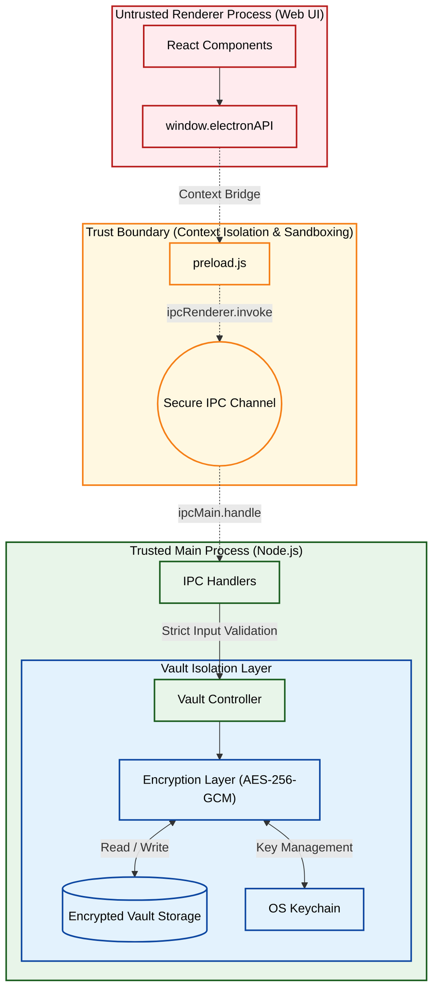

# AURA Vault Architecture: Preload Bridge & IPC

This diagram illustrates the trust boundaries, secure IPC flow, and vault isolation layer within the Electron application.

```mermaid
flowchart TD
    subgraph Renderer["Untrusted Renderer Process (Web UI)"]
        UI[React Components] --> Bridge[window.electronAPI]
    end

    subgraph Boundary["Trust Boundary (Context Isolation & Sandboxing)"]
        Bridge -.->|Context Bridge| Preload[preload.js]
        Preload -.->|ipcRenderer.invoke| IPCChannel((Secure IPC Channel))
    end

    subgraph Main["Trusted Main Process (Node.js)"]
        IPCChannel -.->|ipcMain.handle| Handlers[IPC Handlers]
        
        Handlers -->|Strict Input Validation| Controller[Vault Controller]
        
        subgraph Vault["Vault Isolation Layer"]
            Controller --> Crypto["Encryption Layer (AES-256-GCM)"]
            Crypto <-->|Read / Write| Storage[("Encrypted Vault Storage")]
            Crypto <-->|Key Management| Keychain["OS Keychain"]
        end
    end

    %% Styles for Trust Boundaries
    classDef untrusted fill:#ffebee,stroke:#b71c1c,stroke-width:2px,color:#000
    classDef boundary fill:#fff8e1,stroke:#f57f17,stroke-width:2px,color:#000
    classDef trusted fill:#e8f5e9,stroke:#1b5e20,stroke-width:2px,color:#000
    classDef secure fill:#e3f2fd,stroke:#0d47a1,stroke-width:2px,color:#000

    class Renderer,UI,Bridge untrusted
    class Boundary,Preload,IPCChannel boundary
    class Main,Handlers,Controller trusted
    class Vault,Crypto,Storage,Keychain secure
```
